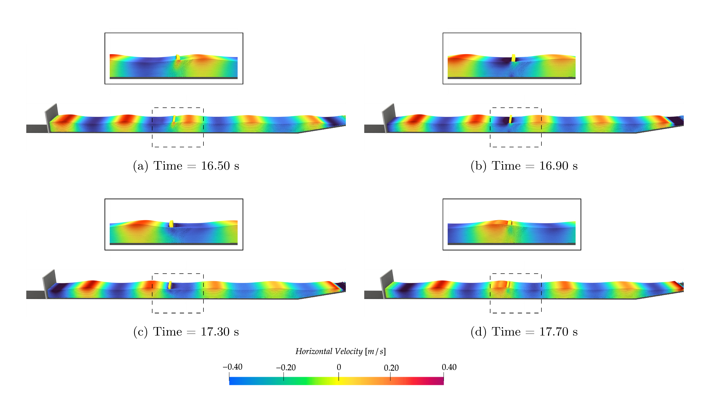
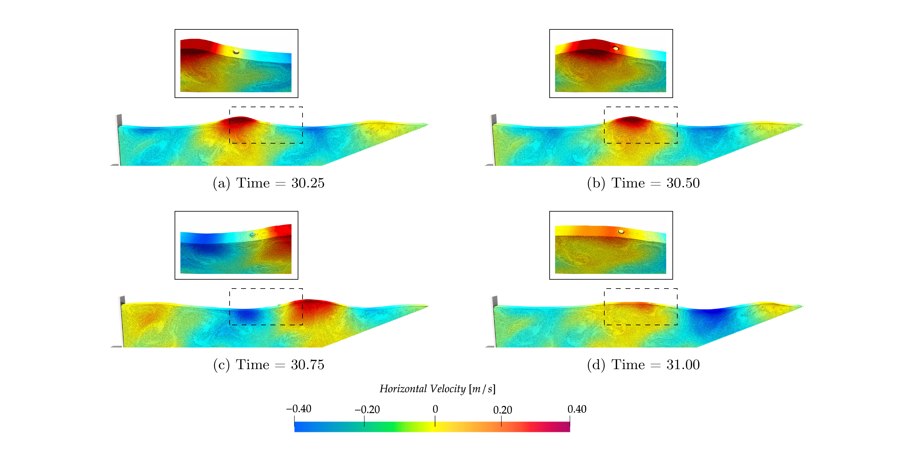
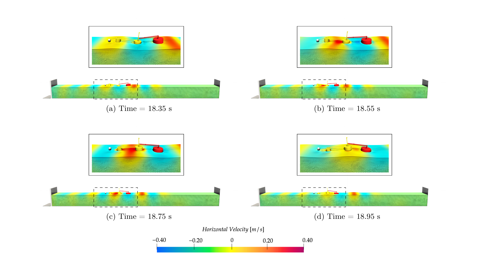

# SPH4WEC

> **DualSPHysics input files for four wave energy converter benchmarks**

[](https://creativecommons.org/licenses/by/4.0/)
[](https://doi.org/10.5281/zenodo.19212580)

This repository contains the configuration files required to reproduce the SPH simulations of four wave energy converter (WEC) devices, as presented in the following companion publications:

- Tagliafierro et al. (2026). *High-fidelity Simulations for Wave Energy Converters — A Review of the Contribution of the Smoothed Particle Hydrodynamics Method.* Energy Reports. *(in preparation)*
- Tagliafierro et al. (2026). *Implementation and validation of DualSPHysics v5.4 for the simulation of wave energy converters: governing equations, multiphysics coupling, and four representative benchmarks.* MethodsX. *(to be co-submitted)*

All simulations were run using **DualSPHysics v5.4.3**, and their outcomes are described and discussed on the MethodsX paper. Other versions may work but compatibility is only guaranteed for v5.4.3.

---

## Contents

### Devices

#### OWSC — IMFIA Oscillating Wave Surge Converter


| | Oscillating wave surge converter |
|---|---|
| **Mooring** | None |
| **PTO** | Rotational |
| **Folder** | `OWSC/` |

<!-- |  | SPH1 | SPH2 | SPH3 |
|---|---:|---:|---:|
| Δp [m] | 0.04 | 0.03 | 0.02 |
| Particles [×10⁶] | 1.28 | 3.77 | 27.53 |
| Runtime [h] | 0.70 | 2.68 | 41.6 |
| RTF [-] | 60 | 241 | 3745 | -->



*Figure 1. Relevant snapshots taken across one wave period for the simulation run with SPH2 for the OWSC. The particle coloring represents the horizontal velocity of the fluid.*


#### UUWEC — Uppsala University Wave Energy Converter

| Property | Value |
|---|---|
| Type | Point absorber |
| Mooring | Taut line |
| PTO | Linear |
| Folder | `UUWEC/` |


*Figure 2. Relevant snapshots taken on right after the first wave crest has passed, for resolution SPH2 for the UUWEC. The particle coloring represents the horizontal velocity of the fluid.*


#### Multifloat M4 — Multi-float Wave Attenuator

| Property | Value |
|---|---|
| Type | Wave attenuator |
| Mooring | Catenary |
| PTO | Rotational |
| Folder | `Multifloat_M4/` |


*Figure 3. Relevant snapshots taken on right after the first wave crest has passed. This data regards resolution SPH2 for the Multi-float M4. The particle coloring represents the horizontal velocity of the fluid.*


#### FOSWEC — Floating Oscillating Wave Surge Converter

| Property | Value |
|---|---|
| Type | Floating OWSC platform |
| Mooring | Taut lines |
| PTO | Rotational |
| Folder | `FOSWEC/` |


*Figure 4. Relevant snapshots taken across one wave period; the zoomed views only show half of the water volume. This data regards resolution SPH2 for the FOSWEC. The particle coloring represents the horizontal velocity of the fluid.*

### File structure

Each device folder follows the same layout:

```
<DEVICE>/
├── *_wave_R[1-3]_Def.xml     # Empty-tank wave propagation at three resolutions
├── *_device_R[1-3]_Def.xml   # Full WEC simulation at three resolutions
├── *.stl                      # Solid body geometries (where applicable)
├── *.dat                      # Wavemaker signal or focused wave input (where applicable)
├── allRun.sh                  # Runs all resolutions sequentially
└── runGPU.sh                  # Runs a single user-specified case on GPU
```

> **Note:** The UUWEC buoy geometry is defined analytically inside the XML file; no STL is required for that case. This folder also includes an extra XML file for the definition of multi-body contact features.

### Resolution convention

Resolutions are labelled consistently across all folders:

| Repository label | Paper label | Description |
|---|---|---|
| R1 | SPH1 | Coarsest |
| R2 | SPH2 | Medium |
| R3 | SPH3 | Finest |

Particle counts, runtimes, and real-time factors (RTF) for each resolution are reported in the MethodsX companion paper.

---

## Getting started

### Requirements

- **DualSPHysics v5.4.3** — available at [https://dual.sphysics.org/downloads](https://dual.sphysics.org/downloads) (GNU LGPL v3)
- **Project Chrono** and **MoorDynPlus** — both coupled with DualSPHysics; no separate installation required
- Linux or Windows (scripts provided for Linux; Windows users should refer to the DualSPHysics documentation)

### Installation

```bash
# Clone this repository
git clone https://github.com/btagliafierro/SPH4WEC.git
cd SPH4WEC

# Download and unzip DualSPHysics v5.4.3 from https://dual.sphysics.org/downloads
# Note the path to the bin/ folder after extraction
```

On Linux, you may need to grant execute permission to the DualSPHysics binaries:

```bash
chmod +x /path/to/DualSPHysics/bin/*
```

The DualSPHysics distribution includes a convenience script to do this — refer to its documentation for details.

### Running a case

```bash
# Navigate to the device folder of interest
cd OWSC

# Run all three resolutions sequentially
./allRun.sh

# Or run a single resolution on GPU
./runGPU.sh <name_xml>
```

> **Warning:** `allRun.sh` does not prompt for confirmation before overwriting existing output folders.

If the DualSPHysics executables are not found automatically, edit the `dirbin` variable at the top of each shell script to point to your local installation.

---

## Case references

| Folder | Numerical setup | Experimental data |
|---|---|---|
| `OWSC/` | Brito et al. (2020), *Renew. Energy* 146, 2024–2043. [doi:10.1016/j.renene.2019.08.034](https://doi.org/10.1016/j.renene.2019.08.034) | Brito et al. (2020), *Renew. Energy* 151, 975–992. [doi:10.1016/j.renene.2019.11.094](https://doi.org/10.1016/j.renene.2019.11.094) |
| `UUWEC/` | Tagliafierro et al. (2022), *Appl. Energy*. [doi:10.1016/j.apenergy.2022.118629](https://doi.org/10.1016/j.apenergy.2022.118629) | Göteman et al. (2015), *International ocean and polar engineering conference* |
| `Multifloat_M4/` | Carpintero Moreno et al. (2020), *Proceedings of 4th International Conference on Renewable Energies Offshore* | Santo et al. (2017), *Journal of Fluid Mechanics* [doi.org/10.1017/jfm.2016.872](https://doi.org/10.1017/jfm.2016.872) |
| `FOSWEC/` | Tagliafierro et al. (2022), *OMAE2022*. | Ruehl et al. (2020), *Ocean Engineering*. [doi.org/10.1016/j.oceaneng.2019.523106575.524](https://doi.org/10.1016/j.oceaneng.2019.523106575.524) |

---


## Availability

| Resource | Link | Description |
|---|---|---|
| Zenodo archive | [](https://doi.org/10.5281/zenodo.19212580) | Citable snapshot tied to the companion publications |
| GitHub repository | [btagliafierro/SPH4WEC](https://github.com/btagliafierro/SPH4WEC) | Living repository — updates, fixes, and new versions |

> If you are reproducing the results of the companion papers, use the **Zenodo archive**.
> For the latest version of the files, refer to the **GitHub repository**.

## Citation

If you use these files in your work, please cite the Zenodo archive:

```bibtex
@misc{Tagliafierro_2026_sph4wec,
  author    = {Tagliafierro, Bonaventura and others},
  title     = {{SPH4WEC}: DualSPHysics input files for four wave energy converter benchmarks},
  year      = {2026},
  publisher = {Zenodo},
  doi       = {10.5281/zenodo.19212580},
  url       = {https://doi.org/10.5281/zenodo.19212580}
}
```
---

## License

The data and configuration files in this repository are released under the
[Creative Commons Attribution 4.0 International License (CC BY 4.0)](https://creativecommons.org/licenses/by/4.0/).

You are free to share and adapt the material for any purpose, including commercially, provided that appropriate credit is given to the authors.

© 2026 Bonaventura Tagliafierro
